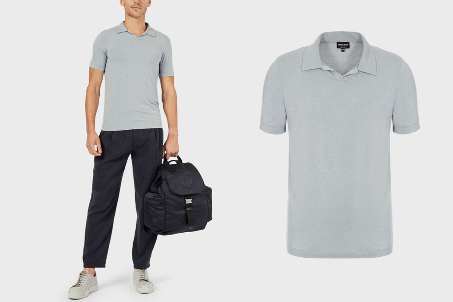
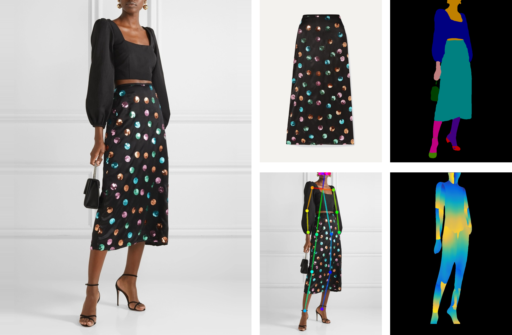

# Dress Code Virtual Try-On Dataset

This repository presents the virtual try-on dataset proposed in:

*D. Morelli, M. Fincato, M. Cornia, F. Landi, F. Cesari, R. Cucchiara* </br>
**Dress Code: High-Resolution Multi-Category Virtual Try-On** </br>

**[Paper]** **[[Dataset Request Form](https://forms.gle/72Bpeh48P7zQimin7)]** 

By making any use of the Dress Code Dataset, you accept and agree to comply with the terms and conditions reported [here](https://github.com/aimagelab/dress-code/blob/main/LICENCE). 

<p align="center">
    
</p>

## Dataset

We collected a new dataset for image-based virtual try-on composed of image pairs coming from different catalogs of YOOX NET-A-PORTER. </br>
The dataset contains more than 50k high resolution model clothing images pairs divided into three different categories (*i.e.* dresses, upper-body clothes, lower-body clothes).

<p align="center">
    
</p>

### Summary
- 53792 garments
- 107584 images
- 3 categories
  - upper body
  - lower body
  - dresses
- 1024 x 768 image resolution
- additional info
  - keypoints
  - skeletons
  - human label maps
  - human dense poses

### Additional Info
Along with model and garment image pair, we provide also the keypoints, skeleton, human label map, and dense pose. 

<p align="center">
  
</p>

<details><summary>More info</summary>

### Keypoints
For all image pairs of the dataset, we stored the joint coordinates of human poses.
In particular, we used [OpenPose](https://github.com/Hzzone/pytorch-openpose) [1] to extract 18 keypoints for each human body. 

For each image, we provided a json file containing a dictionary with the `keypoints` key.
The value of this key is a list of 18 elements, representing the joints of the human body. Each element is a list of 4 values, where the first two indicate the coordinates on the x and y axis respectively.

### Skeletons
Skeletons are RGB images obtained connecting keypoints with lines.

### Human Label Map

We employed a human parser to assign each pixel of the image to a specific category thus obtaining a segmentation mask for each target model. 
Specifically, we used the [SCHP model](https://github.com/PeikeLi/Self-Correction-Human-Parsing) [2] trained on the ATR dataset, a large single person human parsing dataset focused on fashion images with 18 classes.

Obtained images are composed of 1 channel filled with the category label value. 
Categories are mapped as follows:

```ruby
 0    background
 1    hat
 2    hair
 3    sunglasses
 4    upper_clothes
 5    skirt
 6    pants
 7    dress
 8    belt
 9    left_shoe
10    right_shoe
11    head
12    left_leg
13    right_leg
14    left_arm
15    right_arm
16    bag
17    scarf
```


### Human Dense Pose

We also extracted dense label and UV mapping from all the model images using [DensePose](https://github.com/facebookresearch/detectron2/tree/main/projects/DensePose) [3].

</details>

## Experimental Results

### Low Resolution 256 x 192
<table>
<!-- TABLE BODY -->
<tbody>
  <!-- TABLE HEADER -->
    <th valign="bottom">Name</th>
    <th valign="bottom">SSIM</th>
    <th valign="bottom">FID</th>
    <th valign="bottom">KID</th>
  <!-- ROW: CP VTON -->
    <tr>
      <td align="center">CP-VTON [4]</td>
      <td align="center">0.803</td>
      <td align="center">35.16</td>
      <td align="center">2.245</td>
    </tr>
  <!-- ROW: CP VTON+ -->
    <tr>
      <td align="center">CP-VTON+ [5]</td>
      <td align="center">0.902</td>
      <td align="center">25.19</td>
      <td align="center">1.586</td>
    </tr>
  <!-- ROW: CP VTON' -->
    <tr>
      <td align="center">CP-VTON* [4]</td>
      <td align="center">0.874</td>
      <td align="center">18.99</td>
      <td align="center">1.117</td>
    </tr>
  <!-- ROW: FPAFN -->
    <tr>
      <td align="center">PFAFN [6]</td>
      <td align="center">0.902</td>
      <td align="center">14.38</td>
      <td align="center">0.743</td>
    </tr>
  <!-- ROW: VITON GT -->
    <tr>
      <td align="center">VITON-GT [7]</td>
      <td align="center">0.899</td>
      <td align="center">13.80</td>
      <td align="center">0.711</td>
    </tr>
  <!-- ROW: WUTON -->
    <tr>
      <td align="center">WUTON [8]</td>
      <td align="center">0.902</td>
      <td align="center">13.28</td>
      <td align="center">0.771</td>
    </tr>
  <!-- ROW: ACGPN -->
    <tr>
      <td align="center">ACGPN [9]</td>
      <td align="center">0.868</td>
      <td align="center">13.79</td>
      <td align="center">0.818</td>
    </tr>
  <!-- ROW: OURS PSAD -->
    <tr>
      <td align="center">OURS</td>
      <td align="center">0.906</td>
      <td align="center">11.40</td>
      <td align="center">0.570</td>
    </tr>
  </tbody>
</table>

## References

[1] Cao, et al. "OpenPose: Realtime Multi-Person 2D Pose Estimation using Part Affinity Fields." IEEE TPAMI, 2019.

[2] Li, et al. "Self-Correction for Human Parsing." arXiv, 2019.

[3] Güler, et al. "Densepose: Dense human pose estimation in the wild." CVPR, 2018.

[4] Wang, et al. "Toward Characteristic-Preserving Image-based Virtual Try-On Network." ECCV, 2018.

[5] Minar, et al. "CP-VTON+: Clothing Shape and Texture Preserving Image-Based Virtual Try-On." CVPR Workshops, 2020.

[6] Ge, et al. "Parser-Free Virtual Try-On via Distilling Appearance Flows." CVPR, 2021.

[7] Fincato, et al. "VITON-GT: An Image-based Virtual Try-On Model with Geometric Transformations." ICPR, 2020.

[8] Issenhuth, el al. "Do Not Mask What You Do Not Need to Mask: a Parser-Free Virtual Try-On." ECCV, 2020.

[9] Yang, et al. "Towards Photo-Realistic Virtual Try-On by Adaptively Generating-Preserving Image Content." CVPR, 2020.

## Contact

If you have any general doubt about our dataset, please use the [public issues section](https://github.com/aimagelab/dress-code/issues) on this github repo. Alternatively, drop us an e-mail at davide.morelli [at] unimore.it or marcella.cornia [at] unimore.it.
